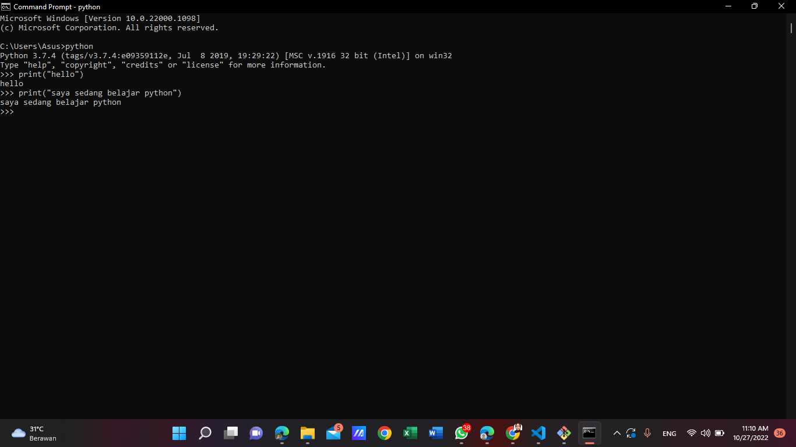
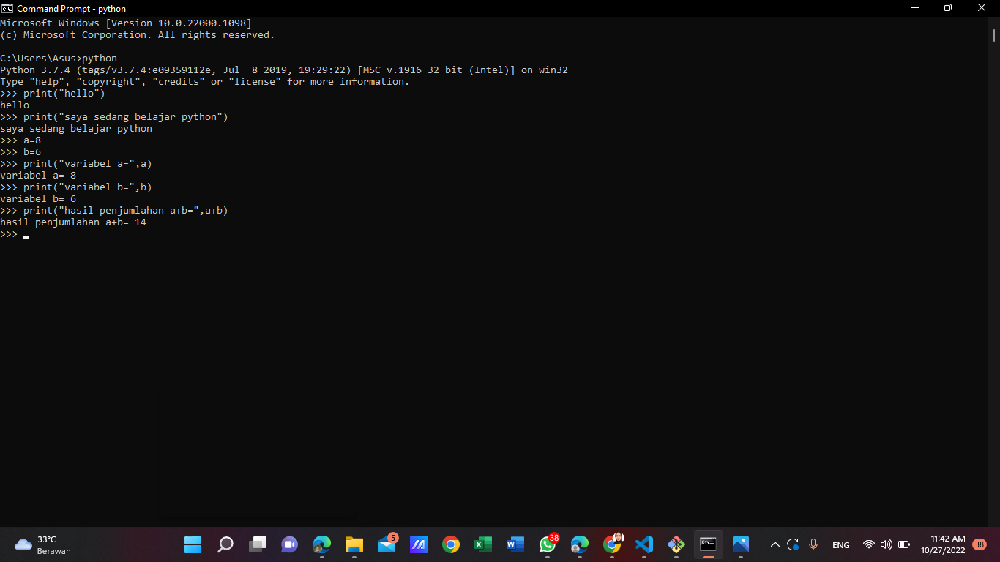
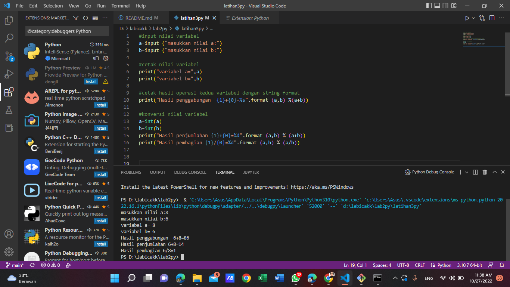

# lab2py
## latihan 1 
Menjalankan Python Console
Menampilkan tulisan “Hello” dilayar
Menampilkan tulisan “Saya sedang belajar python” dilayar

## Latihan 2
Menjumlahkan dua buah bilangan menggunakan variabel a dan b.
Mendefinisikan variable a dengan nilai 8
Mendefinisikan variable b dengan nilai 6
Mencetak nilai variable a dan b
Mencetak hasil penjumlahan a+b

## Latihan 3
 Menjalankan IDLE
 Membuat file baru dengan nama latihan3.py (pastikan lokasi file
 pada folder lab2py pada direktori kerja anda)
 Menggunakan fungsi input untuk mengambil nilai variabel dari
 keyboard.
 # 1.input nilai variabel
 # 2.cetak nilai variabel
 # 3.cetak hasil operasi kedua variabel dengan string format
 # 4.konversi nilai variabel 
## FYI jika TypeError: %d format: a number is required, not str"
## Jika args adalah daftar atau tupel, %s dapat digunakan sebagai pengganti dalam kueri. Jika args adalah dict, %(name)s dapat digunakan sebagai placeholder dalam kueri.

